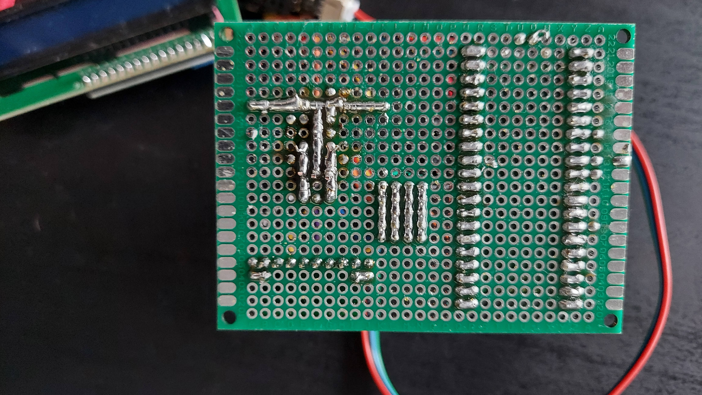
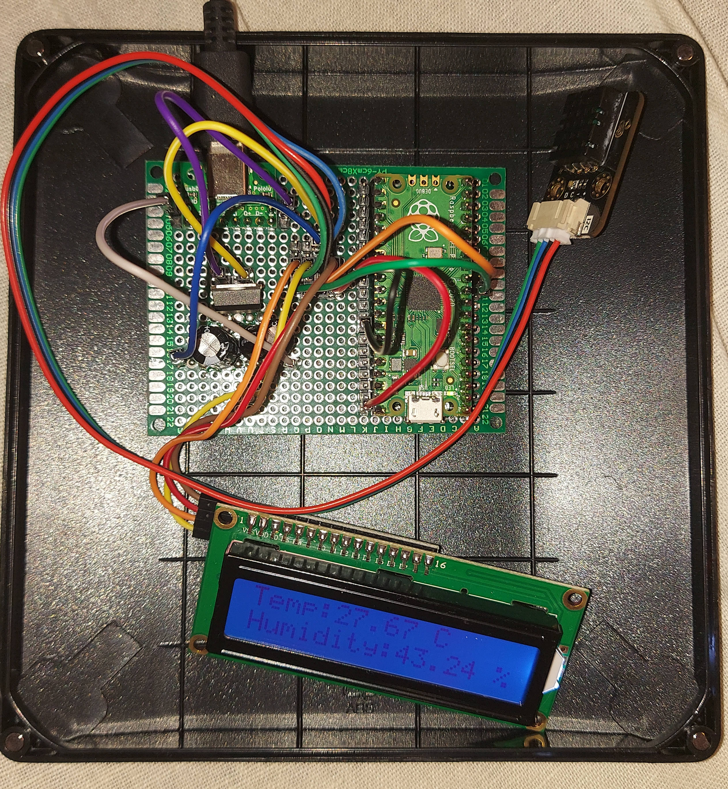
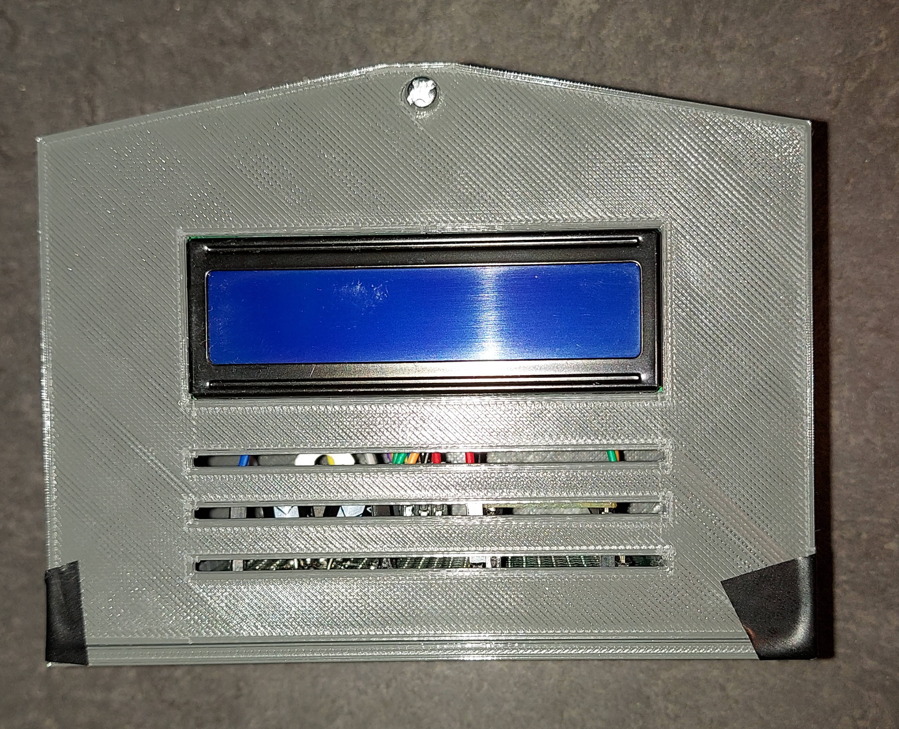
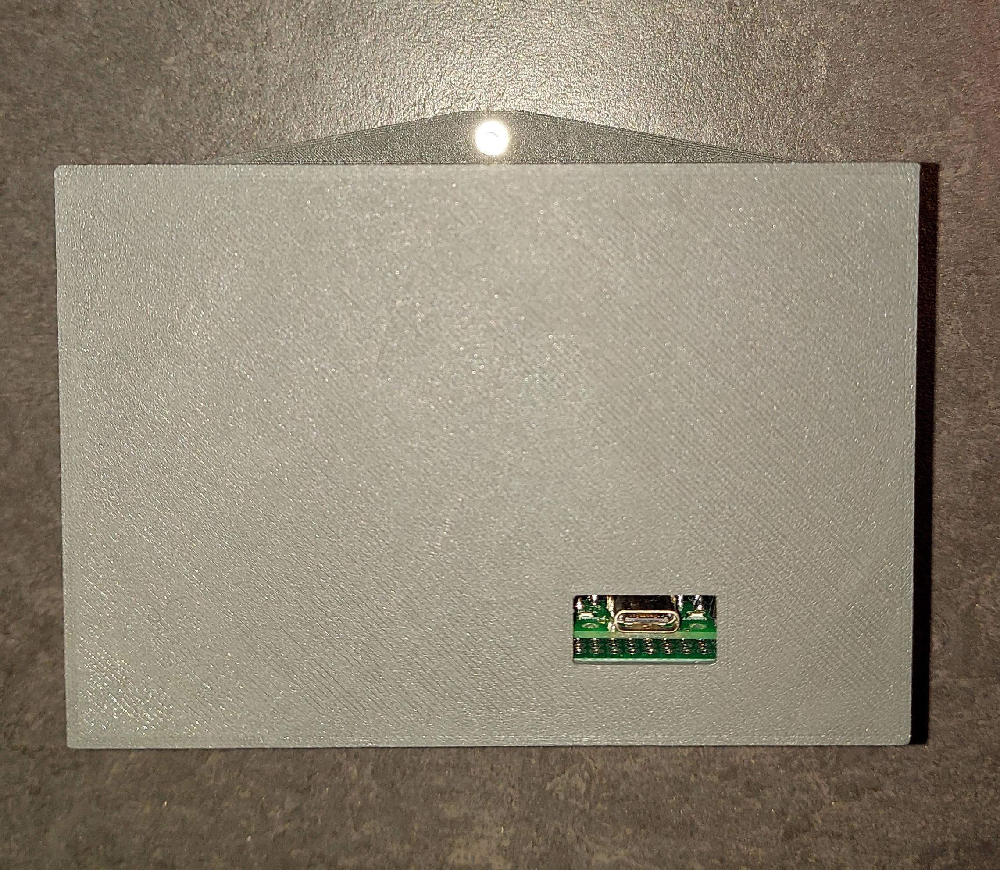
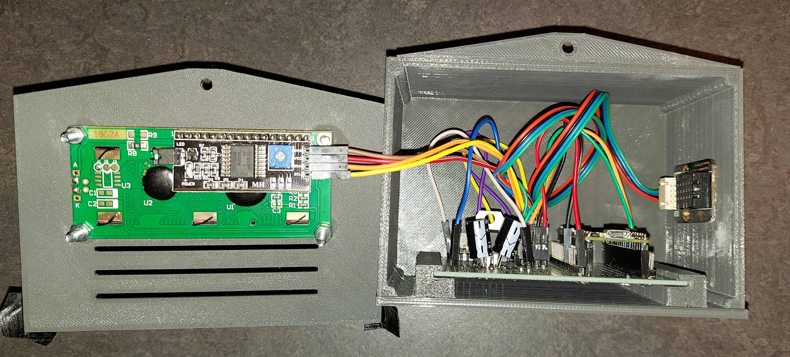

### PicoHomeTemp

USB-C powered Humidity & Temperature sensor with LCD display

---

### Parts
- 1x Raspberry Pi Pico
- 1x Circuit board
- 2x 470 uF capacitors
- 1x USB-C connector
- 1x L7805ABV 5V voltage regulator
- 1x 2x16 LCD display with i2c converter
- Some gold pin connectors
- Some connecting wires

### 3D Printed Case
STL files containing case parts are in `models` directory. Due to my 3D printer extruder failure I encountered some under-extrusion thus I had to use some glue and duct tape to keep everything stick together.

### Media

